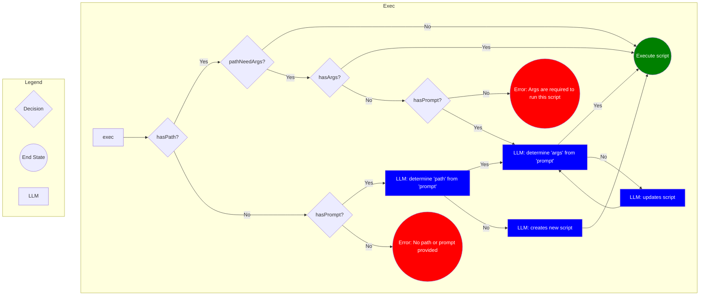

```mermaid
graph TD
subgraph Exec
  A[exec] --> hasPath{hasPath?};

  hasPath -- Yes --> needArgs{pathNeedArgs?};
  needArgs -- No --> Execute((Execute script));
  needArgs -- Yes --> hasArgs{hasArgs?};
  hasArgs -- Yes --> Execute;
  hasArgs -- No --> hasPrompt{hasPrompt?};

  hasPrompt -- No --> Error-A((Error: Args are required to run this script));
  hasPrompt -- Yes --> llm-A[LLM: determine 'args' from 'prompt'];

  llm-A -- Yes --> Execute;
  llm-A -- No --> llm-B[LLM: updates script];
  llm-B --> llm-A

  hasPath -- No --> hasPromptWithPath{hasPrompt?};
  hasPromptWithPath -- Yes --> llm-C[LLM: determine 'path' from 'prompt'];
  hasPromptWithPath -- No --> Error-B((Error: No path or prompt provided));

  llm-C -- Yes --> llm-A;
  llm-C -- No --> llm-D[LLM: creates new script];
  llm-D --> Execute;

  style Error-A fill:Red,color:White;
  style Error-B fill:Red,color:White;
  style Execute fill:Green,color:White;
  style llm-A fill:Blue,color:White;
  style llm-B fill:Blue,color:White;
  style llm-C fill:Blue,color:White;
  style llm-D fill:Blue,color:White;
end
subgraph Legend
  Decision{Decision}
  EndState((End State))
  LLM[LLM]
end
```
